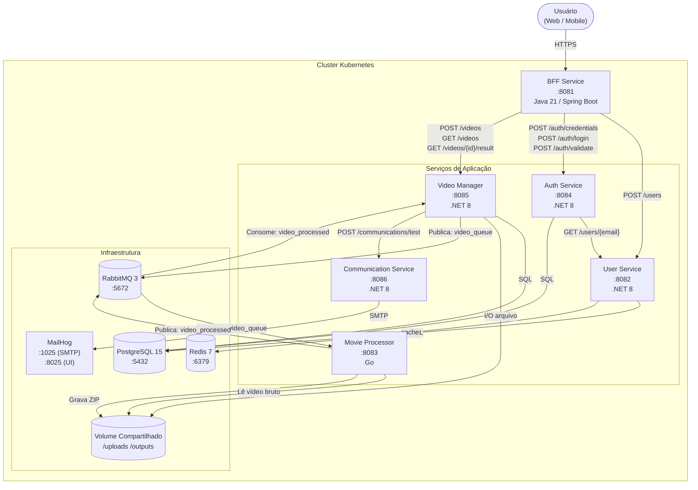

# FIAP Tech Challenge — Fase 5

Documentação principal do ecossistema de microsserviços desenvolvido para o **FIAP Tech Challenge — Fase 5**. O sistema permite que usuários façam upload de vídeos, aguardem o processamento assíncrono de extração de frames e recebam notificações por e-mail com o resultado.

---

## Sumário

- [Visão Geral do Sistema](#visão-geral-do-sistema)
- [Arquitetura do Sistema](#arquitetura-do-sistema)
- [Microserviços](#microserviços)
- [Fluxo Principal do Sistema](#fluxo-principal-do-sistema)
- [Comunicação entre Serviços](#comunicação-entre-serviços)
- [Tecnologias Utilizadas](#tecnologias-utilizadas)
- [Infraestrutura](#infraestrutura)

---

## Visão Geral do Sistema

O sistema é composto por **seis microserviços** e um repositório de infraestrutura. Cada serviço possui uma responsabilidade bem definida e é executado de forma independente em contêineres Docker, orquestrados pelo Kubernetes.

| Serviço | Responsabilidade Principal | Porta |
|---|---|---|
| **BFF Service** | Gateway HTTP único — ponto de entrada para clientes externos | `8081` |
| **User Service** | Cadastro e identificação de usuários | `8082` |
| **Movie Processor Service** | Processamento assíncrono de vídeos (extração de frames) | `8083` |
| **Auth Service** | Autenticação, emissão e validação de tokens JWT | `8084` |
| **Video Manager Service** | Ciclo de vida dos vídeos (upload, metadados, resultado) | `8085` |
| **Communication Service** | Envio de notificações por e-mail via SMTP | `8086` |

Todos os serviços adotam **Clean Architecture** como padrão de estruturação de código, com separação estrita entre camadas de domínio, aplicação, infraestrutura e apresentação.

---

## Arquitetura do Sistema

O ecossistema combina **comunicação síncrona (HTTP REST)** e **comunicação assíncrona (RabbitMQ)**. O diagrama abaixo representa os componentes principais e seus relacionamentos:



---

## Microserviços

### BFF Service

**Linguagem / Framework:** Java 21 — Spring Boot 4.0.2  
**Porta:** `8081`  
**Arquitetura:** Clean Architecture + Hexagonal (Ports & Adapters)

O BFF (Backend for Frontend) é o único ponto de entrada HTTP para clientes externos. Ele orquestra o fluxo de cadastro (criando usuário no User Service e credenciais no Auth Service), valida tokens JWT antes de cada operação protegida e repassa chamadas de upload, listagem e download ao Video Manager Service.

O BFF **não possui banco de dados próprio** e **não consome filas de mensageria diretamente**.

---

### User Service

**Linguagem / Framework:** .NET 8 — ASP.NET Core  
**Porta:** `8082`  
**Arquitetura:** Clean Architecture

Gerencia o cadastro e a identificação de usuários. Valida o CPF pelo algoritmo oficial e o formato de e-mail. Utiliza **Redis** como cache distribuído (TTL de 1 hora) para leituras repetidas, reduzindo carga no banco de dados.

Toda comunicação é síncrona via HTTP REST. O serviço não utiliza mensageria.

---

### Auth Service

**Linguagem / Framework:** .NET 8 — ASP.NET Core  
**Porta:** `8084` (HTTP) / `9094` (HTTPS)  
**Arquitetura:** Clean Architecture

Responsável pela segurança do ecossistema: registro de credenciais, autenticação, emissão de tokens JWT (HMAC-SHA256) e validação de tokens. Implementa bloqueio de conta após 5 tentativas de login consecutivas com falha (bloqueio de 5 minutos). Consulta o User Service via HTTP para verificar se o usuário está ativo antes de emitir um token.

Não utiliza mensageria. É consumido exclusivamente pelo BFF Service.

---

### Video Manager Service

**Linguagem / Framework:** .NET 8 — ASP.NET Core  
**Porta:** `8085`  
**Arquitetura:** Clean Architecture

Gerencia o ciclo de vida completo dos vídeos. Recebe uploads (até 500 MB via multipart/form-data), persiste metadados no PostgreSQL, grava o arquivo bruto no storage compartilhado e publica mensagem na fila `video_queue` do RabbitMQ para acionar o processamento. Consome a fila `video_processed` para receber o resultado e, ao concluir, notifica o usuário via chamada HTTP ao Communication Service.

**Estados do vídeo:** `PendingUpload → Processing → Finished | ProcessingFailed`

---

### Movie Processor Service

**Linguagem / Framework:** Go  
**Porta:** `8083`  
**Arquitetura:** Clean Architecture

Worker assíncrono puro — **não expõe nenhuma API REST**. Consome mensagens da fila `video_queue`, utiliza **FFmpeg** para extrair frames do vídeo (1 frame por segundo, formato PNG), empacota os frames em um arquivo `.zip` e publica o resultado na fila `video_processed`. Implementa retry automático (até 3 tentativas com intervalo de 2 segundos). As réplicas mínimas no Kubernetes são 2, podendo escalar até 3.

---

### Communication Service

**Linguagem / Framework:** .NET 8 — ASP.NET Core  
**Porta:** `8086` (HTTP) / `9096` (HTTPS)  
**Arquitetura:** Clean Architecture

Responsável exclusivamente pelo envio de notificações por e-mail. Recebe chamadas HTTP do Video Manager Service, seleciona o template adequado (sucesso ou falha), gera o corpo do e-mail e o envia via SMTP (MailHog em ambiente local).

**Não possui banco de dados próprio.** O fluxo ativo é via HTTP; o código contém uma implementação de consumidor RabbitMQ (`communication_queue`) que está presente mas **não ativa** no fluxo atual.

---

## Fluxo Principal do Sistema

### 1. Cadastro de Usuário

```
Cliente → POST /api/auth/signup  (BFF Service)
  BFF → POST /users              (User Service  — cria perfil)
  BFF → POST /auth/credentials   (Auth Service  — registra credenciais)
  BFF → POST /auth/login         (Auth Service  — emite JWT)
  BFF ← 200 OK { token: "..." }
Cliente ← JWT
```

### 2. Login

```
Cliente → POST /api/auth/login   (BFF Service)
  BFF → POST /auth/login         (Auth Service  — valida credenciais, emite JWT)
Cliente ← 200 OK { token: "..." }
```

### 3. Upload e Processamento de Vídeo

```
Cliente → POST /api/bridge/process  (BFF Service — Bearer token)
  BFF → POST /auth/validate          (Auth Service — valida token)
  BFF → POST /videos                 (Video Manager Service)
    Video Manager → salva arquivo em /uploads   (Shared Storage)
    Video Manager → persiste metadados           (PostgreSQL)
    Video Manager → publica em video_queue       (RabbitMQ)
  ↓ (assíncrono)
  Movie Processor → consome video_queue          (RabbitMQ)
  Movie Processor → lê vídeo bruto               (Shared Storage)
  Movie Processor → extrai frames via FFmpeg
  Movie Processor → grava ZIP em /outputs        (Shared Storage)
  Movie Processor → publica em video_processed   (RabbitMQ)
  ↓
  Video Manager → consome video_processed        (RabbitMQ)
  Video Manager → atualiza status no banco       (PostgreSQL)
  Video Manager → POST /communications/test      (Communication Service)
    Communication Service → envia e-mail         (MailHog SMTP)
```

### 4. Listagem de Vídeos

```
Cliente → GET /api/bridge/list?skip=0&take=10   (BFF Service — Bearer token)
  BFF → POST /auth/validate                      (Auth Service)
  BFF → GET /videos?skip=0&take=20               (Video Manager Service)
Cliente ← [ { VideoId, OriginalFileName, Status, ResultAvailable, ... } ]
```

### 5. Download do Resultado

```
Cliente → GET /api/bridge/{id}/download   (BFF Service — Bearer token)
  BFF → POST /auth/validate               (Auth Service)
  BFF → GET /videos/{id}/result           (Video Manager Service — streaming ZIP)
Cliente ← arquivo .zip (frames extraídos)
```

---

## Comunicação entre Serviços

### Comunicação Síncrona (HTTP REST)

| Origem | Destino | Endpoint | Finalidade |
|---|---|---|---|
| BFF Service | User Service | `POST /users` | Criar perfil de usuário no cadastro |
| BFF Service | Auth Service | `POST /auth/credentials` | Registrar credenciais no cadastro |
| BFF Service | Auth Service | `POST /auth/login` | Autenticar usuário |
| BFF Service | Auth Service | `POST /auth/validate` | Validar token JWT em cada requisição protegida |
| BFF Service | Video Manager | `POST /videos` | Enviar upload de vídeo |
| BFF Service | Video Manager | `GET /videos` | Listar vídeos do usuário |
| BFF Service | Video Manager | `GET /videos/{id}/result` | Baixar resultado processado |
| Auth Service | User Service | `GET /users/{email}` | Verificar se usuário existe e está ativo |
| Video Manager | Communication Service | `POST /communications/test` | Notificar resultado do processamento |

### Comunicação Assíncrona (RabbitMQ)

| Fila | Produtor | Consumidor | Conteúdo |
|---|---|---|---|
| `video_queue` | Video Manager Service | Movie Processor Service | Tarefa de processamento com `input_path` do vídeo |
| `video_processed` | Movie Processor Service | Video Manager Service | Resultado com `output_path` e status (`SUCCESS` / `ERROR`) |

---

## Tecnologias Utilizadas

### Linguagens e Frameworks

| Tecnologia | Versão | Serviços |
|---|---|---|
| .NET / ASP.NET Core | 8 | Auth, User, Video Manager, Communication |
| Java / Spring Boot | 21 / 4.0.2 | BFF |
| Go | — | Movie Processor |

### Persistência e Cache

| Tecnologia | Versão | Uso |
|---|---|---|
| PostgreSQL | 15 | Auth (`auth_db`), User (`user_db`), Video Manager (`video_manager_db`) |
| Redis | 7 | Cache de usuários no User Service (TTL 1 hora) |

### Mensageria e Comunicação

| Tecnologia | Versão | Uso |
|---|---|---|
| RabbitMQ | 3 | Desacoplamento entre Video Manager e Movie Processor |
| MailHog | latest | Servidor SMTP simulado para testes locais de e-mail |

### Processamento

| Tecnologia | Uso |
|---|---|
| FFmpeg | Extração de frames de vídeo no Movie Processor (1 frame/segundo) |

### Infraestrutura e Orquestração

| Tecnologia | Uso |
|---|---|
| Docker | Contêinerização de todos os serviços |
| Kubernetes | Orquestração e auto-escalonamento (HPA) |
| Helm | Provisionamento declarativo do cluster via Chart |

### Segurança

| Tecnologia | Uso |
|---|---|
| JWT (HMAC-SHA256) | Autenticação stateless emitida pelo Auth Service |
| Spring Security | Filtro de autenticação no BFF Service |
| SHA-256 | Hashing de senhas no Auth Service |

### Testes

| Tecnologia | Serviços |
|---|---|
| xUnit + Moq + FluentAssertions | Auth, User, Communication |
| JUnit / Spring Boot Test | BFF |
| Go test | Movie Processor |

---

## Infraestrutura

O repositório de infraestrutura contém um **Helm Chart** que provisiona todo o ecossistema em um cluster Kubernetes. Os recursos incluem:

- **6 Deployments** (um por serviço)
- **PostgreSQL** (único pod com 3 bancos: `auth_db`, `user_db`, `video_manager_db`)
- **Redis** para cache do User Service
- **RabbitMQ** como StatefulSet com gerenciamento web (`localhost:15672`)
- **MailHog** para SMTP de desenvolvimento
- **PersistentVolumeClaim** (`fase-05-movie-storage`, 5Gi) compartilhado entre Video Manager e Movie Processor
- **HorizontalPodAutoscaler** por serviço (escalonamento por CPU ≥ 30% e memória ≥ 70%)
- **Kubernetes Secrets** para PostgreSQL, RabbitMQ e chave JWT
- **DaemonSet sysctl-inotify** para ajuste de parâmetros do kernel (monitoramento de arquivos)

### Auto-escalonamento (HPA)

| Serviço | Réplicas mínimas | Réplicas máximas |
|---|---|---|
| BFF | 1 | 1 |
| User Service | 1 | 1 |
| Auth Service | 1 | 1 |
| Video Manager | 1 | 2 |
| Movie Processor | 2 | 3 |
| Communication Service | 1 | 1 |

---

## Documentação Complementar

| Documento | Descrição |
|---|---|
| [architecture/system-context.md](architecture/system-context.md) | Contexto do sistema e posição no ecossistema |
| [architecture/containers.md](architecture/containers.md) | Arquitetura de microserviços e responsabilidades |
| [architecture/flows.md](architecture/flows.md) | Fluxos de comunicação, mensageria e storage |
| [c4/level-1-system-context.md](c4/level-1-system-context.md) | Diagrama C4 Nível 1 — Contexto do Sistema |
| [c4/level-2-containers.md](c4/level-2-containers.md) | Diagrama C4 Nível 2 — Containers |
| [services/auth.md](services/auth.md) | Resumo do Auth Service |
| [services/user.md](services/user.md) | Resumo do User Service |
| [services/video-manager.md](services/video-manager.md) | Resumo do Video Manager Service |
| [services/movie-processor.md](services/movie-processor.md) | Resumo do Movie Processor Service |
| [services/communication.md](services/communication.md) | Resumo do Communication Service |
| [services/bff.md](services/bff.md) | Resumo do BFF Service |
| [services/infra.md](services/infra.md) | Resumo do Repositório de Infraestrutura |
