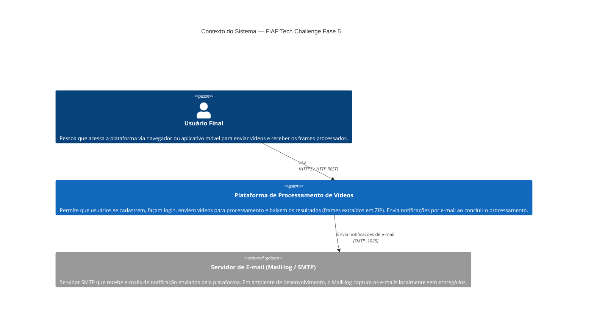

# C4 — Nível 1: Contexto do Sistema

> **Modelo C4** — Nível 1 representa o sistema como uma caixa única e mostra como ele se relaciona com seus usuários e sistemas externos.

---

## Diagrama

---

## Descrição dos Elementos

### Usuário Final

Pessoa que interage com a plataforma diretamente. Realiza as seguintes ações:

- Cria uma conta (nome, e-mail, CPF, senha).
- Autentica-se e obtém um token JWT.
- Envia arquivos de vídeo para processamento.
- Consulta a lista de vídeos enviados e seus status.
- Baixa o arquivo `.zip` com os frames extraídos quando o processamento é concluído.
- Recebe um e-mail de notificação (sucesso ou falha) ao final do processamento.

### Plataforma de Processamento de Vídeos

Sistema desenvolvido para o FIAP Tech Challenge Fase 5. Internamente composto por seis microserviços independentes que colaboram para oferecer as funcionalidades descritas. Para o usuário final, o sistema se apresenta como um único endpoint HTTP.

Responsabilidades do sistema (visão externa):

| Funcionalidade | Descrição |
|---|---|
| Autenticação | Cadastro de conta, login e validação de JWT. |
| Upload de vídeos | Recepção e armazenamento de arquivos de vídeo. |
| Processamento de vídeos | Extração de frames (1 frame/segundo) e geração de arquivo ZIP. |
| Consulta de status | Acompanhamento do ciclo de vida de cada vídeo. |
| Download | Entrega do arquivo ZIP com os frames ao usuário. |
| Notificação | Envio de e-mail ao concluir o processamento. |

### Servidor de E-mail (MailHog / SMTP)

Sistema externo responsável por receber e-mails enviados pela plataforma. Em ambiente de desenvolvimento, o **MailHog** simula um servidor SMTP real, capturando e-mails e exibindo-os em uma interface web (`localhost:8025`). Em produção, poderia ser substituído por um servidor SMTP real.

---

## Fronteiras e Restrições

- O acesso externo ao sistema ocorre **exclusivamente** pelo BFF Service (porta `8081`). Os demais serviços não são expostos externamente.
- A comunicação entre o usuário e o sistema utiliza **Bearer Token JWT** para autenticação stateless.
- O sistema não realiza envio de e-mails reais em ambiente de desenvolvimento.
