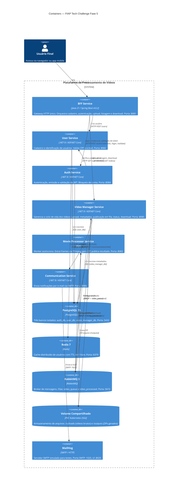
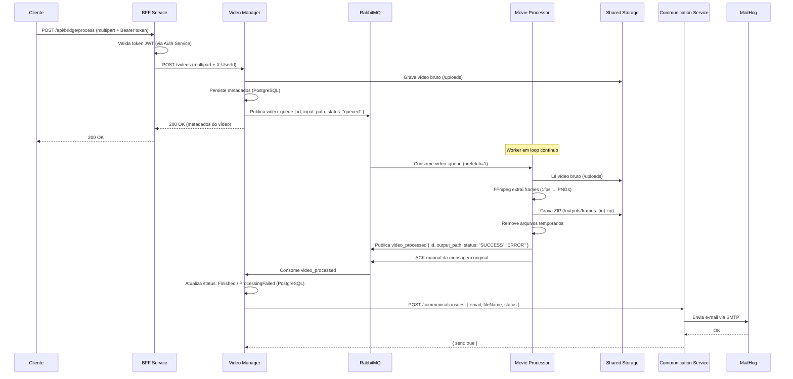
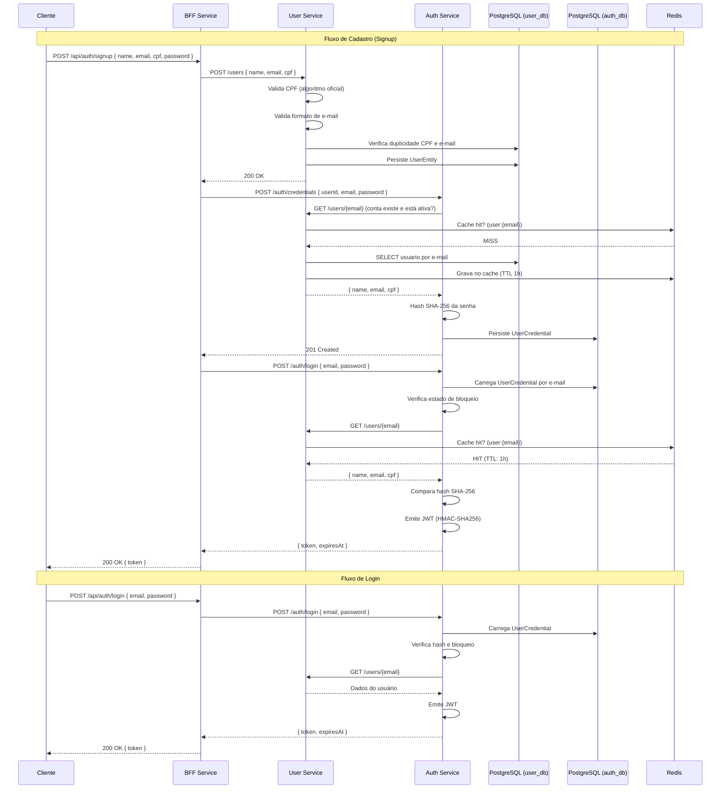
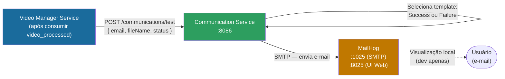

# C4 — Nível 2: Containers

> **Modelo C4** — Nível 2 expande o sistema em seus containers (processos separados, serviços, bancos de dados, etc.) e mostra como eles se comunicam.

---

## Diagrama Geral dos Containers

---

## Diagrama — Fluxo de Mensageria RabbitMQ

---

## Diagrama — Fluxo de Autenticação e Cadastro

---

## Diagrama — Notificação por E-mail (SMTP)

**Templates de e-mail:**

| Status recebido | Assunto | Conteúdo |
|---|---|---|
| `Finished` | Processamento concluído: seu vídeo está disponível | Informa que o processamento foi bem-sucedido e o resultado está disponível para download. |
| Qualquer outro | Falha no processamento do seu vídeo | Informa que o processamento falhou e solicita nova tentativa. |

---

## Resumo das Responsabilidades por Container

| Container | Tipo | Linguagem | Banco | Fila | Porta |
|---|---|---|---|---|---|
| BFF Service | API Gateway | Java 21 | — | — | 8081 |
| User Service | Microserviço | .NET 8 | PostgreSQL (user_db) + Redis | — | 8082 |
| Movie Processor | Worker assíncrono | Go | — | Consumer: video_queue / Publisher: video_processed | 8083 |
| Auth Service | Microserviço | .NET 8 | PostgreSQL (auth_db) | — | 8084 |
| Video Manager | Microserviço | .NET 8 | PostgreSQL (video_manager_db) | Publisher: video_queue / Consumer: video_processed | 8085 |
| Communication Service | Microserviço | .NET 8 | — | — | 8086 |
| PostgreSQL 15 | Banco de dados | — | — | — | 5432 |
| Redis 7 | Cache | — | — | — | 6379 |
| RabbitMQ 3 | Broker | — | — | video_queue, video_processed | 5672 |
| Volume Compartilhado | Storage | — | — | — | — |
| MailHog | SMTP simulado | — | — | — | 1025 / 8025 |
